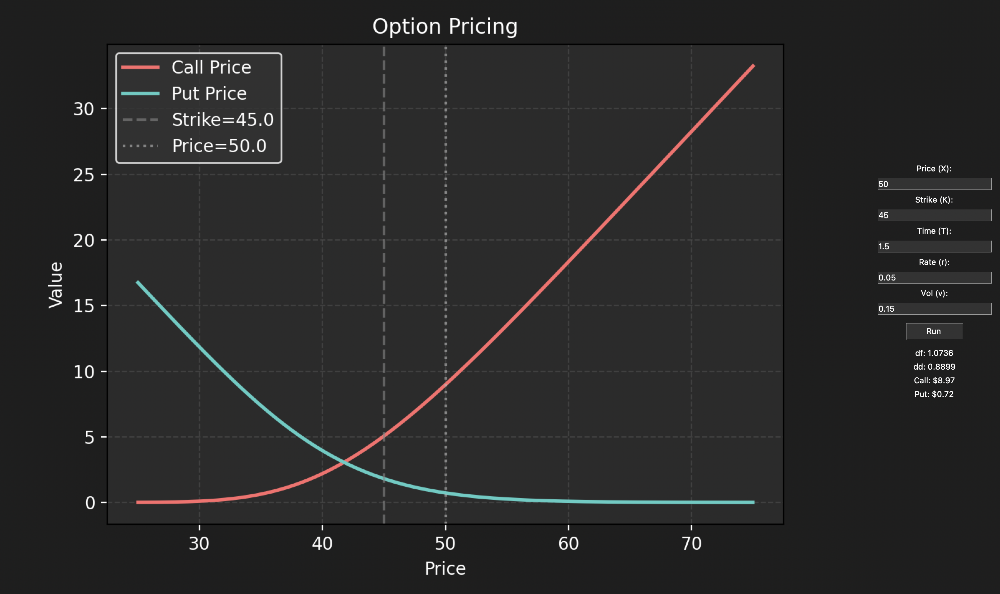

# Black-Scholes Calculator

- This project calculates and visualizes **call** and **put** option prices using the Black-Scholes model.
- It features an interactive GUI built with Tkinter and real-time plotting of option values.

---

## Files
- `black_scholes_calc.py`: Main script containing the option pricing logic, GUI, and visualization.
- `output.png`: Plot.

---

## Libraries Used
- `math`
- `numpy`
- `scipy.stats`
- `matplotlib.pyplot`
- `tkinter`

---

## Functionality
- **Inputs**: 
  - Current price (X)
  - Strike price (K)
  - Time to expiration (T, in years)
  - Risk-free rate (r)
  - Volatility (v)
- **Outputs**: 
  - Call and put option prices
  - Intermediate values (d1, d2)
  - Interactive plot showing call/put prices over a range of stock prices

---

## Features
- Real-time updates: Adjust inputs and see immediate results in both text and graphical form.
- Plot includes:
  - Call price curve
  - Put price curve
  - Current price marker
  - Strike price marker
- Input validation to ensure positive values (except rate) and non-negative rate.

## Screenshots

